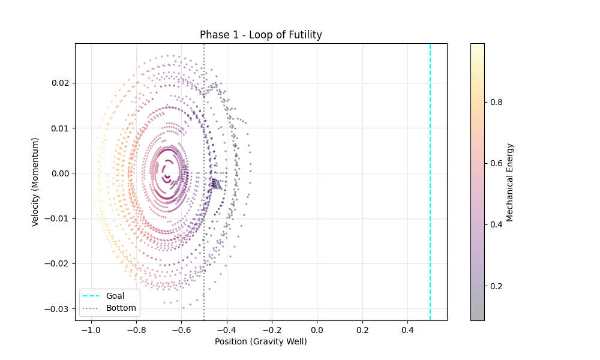
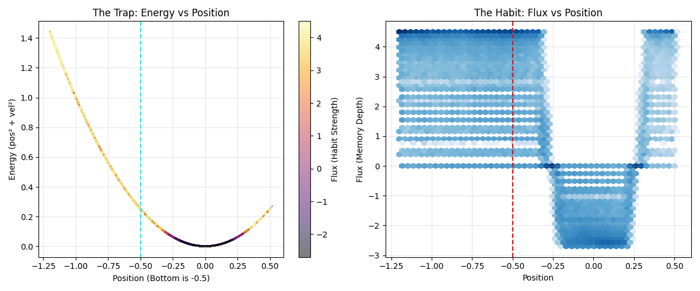
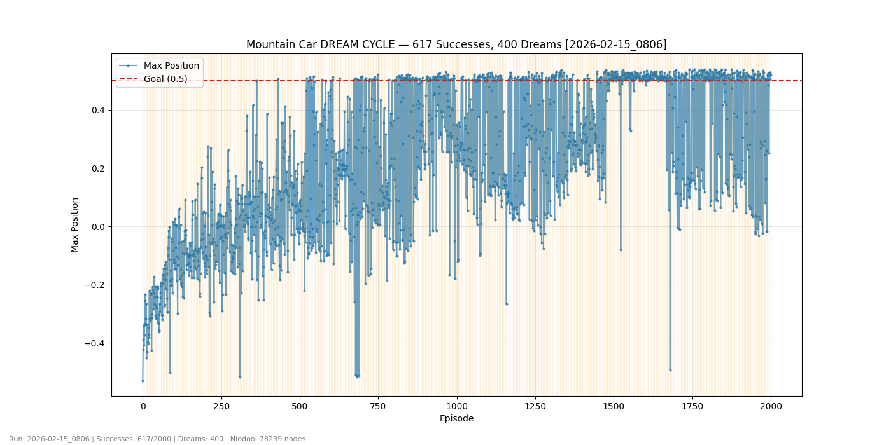
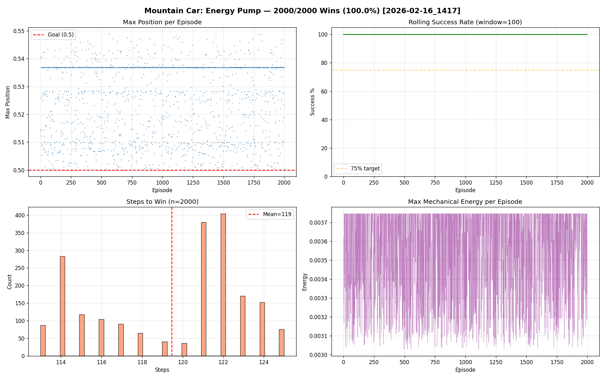
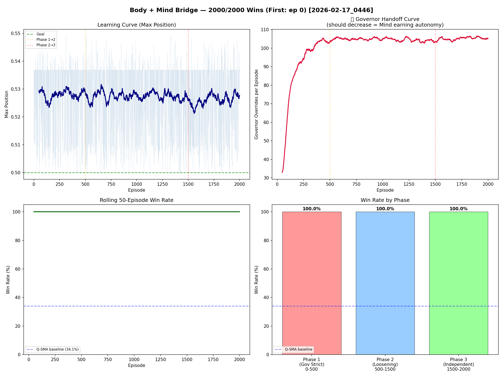
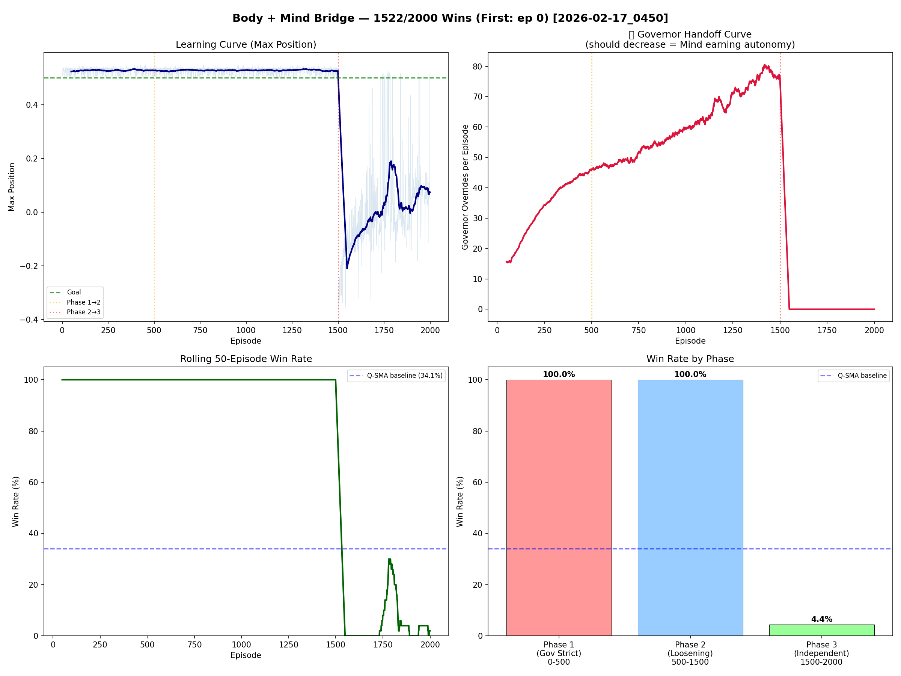
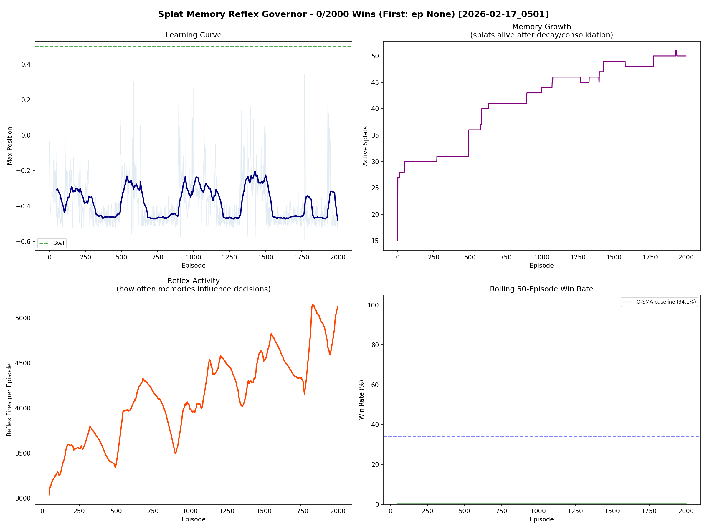
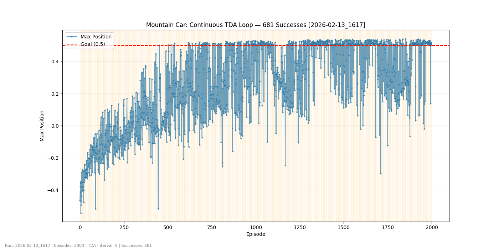
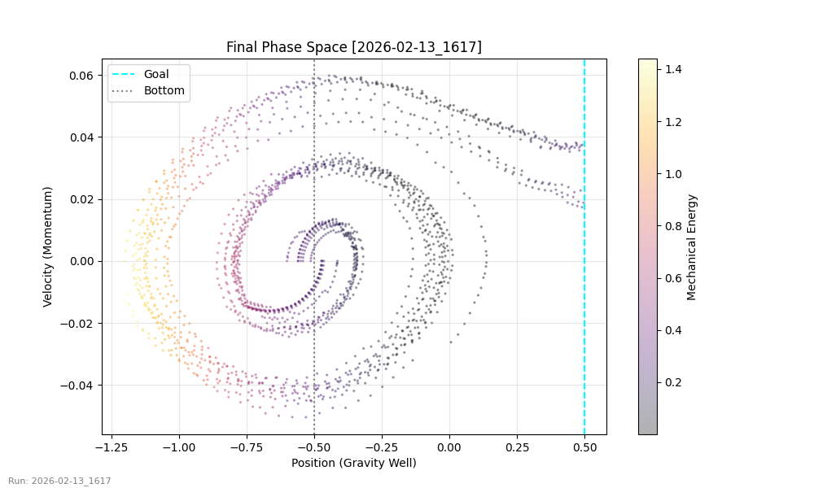

# The Physics of Friendship: MountainCar Q-SMA

> **An exploration of how habits, topology, memory, and physics combine to teach an agent to escape a valley.**

This is a research project exploring reinforcement learning on the MountainCar-v0 environment using **Q-SMA** (Q-Learning + Sensory-Motor Attunement) — a hybrid architecture that blends classical RL with biologically-inspired systems: habit formation (Flux), topological self-monitoring (TDA), dream replay, Gaussian "scar tissue" memory (Splats), and a Niodoo physics engine patterned on LLM force dynamics.

This is not a polished framework. It's the raw, messy record of a research journey — from 0% success to 681/2000 wins across 4 phases over February 2026.

---

## Quick Start

```bash
# Clone
git clone https://github.com/Ruffian-L/physics-of-friendship-mountaincar-rl.git
cd physics-of-friendship-mountaincar-rl

# Install dependencies
pip install -r requirements.txt

# Run the main experiment (2000 episodes, ~10-15 min)
cd src
python main.py

# Run with visual rendering
python main.py --render

# Run the physics-only solver (2000/2000 wins, ~2 min)
python models/physics_niodoo.py
```

---

## What's in Here

```
src/
├── main.py                 # Main training loop (2000 episodes, TDA every 5)
├── core/
│   ├── agent.py            # Q-SMA agent: Q-table + Flux + Curiosity + Dreams
│   ├── tda.py              # Topological Brain: loop/void detection via Ripser
│   ├── steering.py         # Steering Controller: TDA → parameter adjustments
│   └── watcher.py          # DaydreamWatcher: background Flux landscape shaping
└── models/
    ├── physics_niodoo.py   # Niodoo physics engine (LLM force vocabulary)
    ├── bridge.py           # Body↔Mind bridge (InstinctSeeder, DreamTeacher, GovernorGate)
    ├── splat_memory.py     # Gaussian volumetric reflex memory
    └── niodoo.py           # Niodoo persistent memory graph

snapshots/                  # Frozen checkpoints at key milestones
├── 2026-02-13_1456_76wins/
├── FINAL_CHAMPION_681wins_LOG_FLUX/
└── ...

research_history/           # Phase-by-phase plots and logs
├── Phase_1_2026-02-13_TDA_Steering/
├── Phase_2_2026-02-15_Niodoo_Dream/
├── Phase_3_2026-02-16_Physics_Solver/
└── Phase_4_2026-02-17_Splat_Bridge/

scripts/
└── diagnose_well_addiction.py  # Diagnostic: visualizes the "well trap"
```

---

## The Problem

MountainCar-v0 is deceptively hard for RL. The car starts in a valley and must build momentum by swinging back and forth to reach a goal on the right hilltop. The reward is -1 per timestep (pure punishment), so the agent gets no signal about *how* to improve — only that it's failing. Most Q-learning agents never solve it.

---

## The Architecture: Q-SMA

**Q-SMA** stands for Q-Learning + Sensory-Motor Attunement. The core idea: an agent needs both *logic* (Q-values: what works) and *habit* (Flux: what feels natural), and must learn to transition from one to the other.

### Action Selection
```
π(s) = argmax_a [ Q(s,a) + ease(F(s,a)) × β + C(s,a) ]
```
- **Q(s,a)** — learned value (logic, System 2)
- **F(s,a)** — Flux/habit strength, passed through a sigmoid (System 1)
- **β** — confidence scaling, decays over training: `β = max(0.1, 1.5 × 0.995^episode)`
- **C(s,a)** — curiosity bonus from TDA-injected attractors

### Yin-Yang Reward Shaping
The breakthrough insight. Instead of raw -1 per step, the agent receives a physics-based shaped reward:
```
R_shaped = R + κ × [Φ(s') − Φ(s)]
```
where `Φ(s) = sin(3x) + 100v²` — a potential function that naturally creates balanced positive (gaining energy) and negative (losing energy) signals.

### TDA Metacognitive Loop
Every 5 episodes, the agent's recent trajectory is analyzed topologically:
- **Loop detection**: density heuristics + persistent homology (Ripser) detect stuck patterns
- **Void detection**: histogram analysis finds unexplored regions near the goal
- **Intervention**: decay spikes break bad habits; attractor injection encourages exploration

### Dream Cycle
Between episodes, the agent replays experiences weighted by Splat Memory proximity — obsessing about victories during sleep to build "neural superhighways" in the Flux landscape.

---

## Research Phases & Results

### Phase 1: TDA Steering (Feb 13) — 0 → 76 → 681 wins

The foundational work. Key breakthroughs:
1. **Yin-Yang Reward** — potential-based shaping that creates balanced pos/neg signals
2. **Confidence Scaling** — beta decay transitions habit→logic
3. **Spike Cooldown** — prevents TDA from over-intervening

The emergent **zig-zag learning pattern** (Hot → Complacent → Cold → Rebound) was discovered here — learning isn't monotonic, it oscillates upward.

#### The Zig-Zag: Hot/Cold Oscillation to Convergence


#### Phase Space: From Loop of Futility → Post-TDA Healing
| Before TDA | After TDA |
|:---:|:---:|
|  |  |

#### The Well Addiction Trap


### Phase 2: Niodoo Dream (Feb 15) — 617 wins

Introduced the Niodoo physics engine and dream replay. Forces from an LLM-inspired vocabulary (Gravity Well, Repulsion, Viscosity, Adrenaline, Ghost Vector) are mapped to Mountain Car physics.



### Phase 3: Energy Pump (Feb 16) — 2000/2000 wins (100%)

The "push it in the direction it's going" heuristic. A trivially perfect solver (~119 steps/episode) that bypasses learning entirely. This is the well-known resonance strategy — it works, but it doesn't learn.



### Phase 4: The Bridge Experiments (Feb 17) — The Most Revealing Phase

**The question:** Can a perfect "body" (energy pump) teach a learning "mind" (Q-SMA)?

**Run 1 (Bridge 2000/2000):** Looks perfect — but the Governor override curve goes *up*, not down. The body does all the work. The mind never learns.



**Run 2 (Bridge 1522/2000):** The real test. Governor overrides drop to 0 at episode 1500. The mind immediately collapses to **4.4% win rate** — *worse* than the Q-SMA baseline of 34.1%.



> **The most important finding:** Having a perfect teacher override your decisions doesn't teach you anything. The teacher actively *prevented* learning by shielding the agent from consequences.

**Splat Memory Pivot:** 12 iterations evolving from splat reflexes in action selection (0/2000 — reflex spam at 3000-5000/ep overwhelmed the agent) to splats influencing only dream replay (628/2000 — soft curriculum through sleep).

| Splat Reflexes ON (0/2000 wins) | Splat Dreams Only (599/2000 wins) |
|:---:|:---:|
|  |  |

---

## Hypotheses

| Hypothesis | Status | Evidence |
|:-----------|:-------|:---------|
| Yin-Yang Reward (potential-based shaping) | ✅ Confirmed | 0 → 76 wins on this single change |
| System 1→2 Handoff (beta decay) | ✅ Confirmed | Breakthroughs cluster when beta hits floor |
| TDA Metacognitive Loop | ⚠️ Partial | Loop detection works; unclear if Ripser adds value over density heuristic |
| Viscosity/Flow Physics Model | ❌ Failed → adapted | "Correct" physics = 0 wins; naive binary = 76; log-scale = 681 |
| Splat Memory Reflexes | ⚠️ Uncertain | Disabled in act(); only influence dreams. Untested in final form |
| Niodoo Force Vocabulary | ⚠️ Partial | Works as standalone solver; unclear contribution in mixed system |
| Bridge (Body→Mind) | ❌ Failed as designed | Perfect teacher prevents learning; 4.4% when independent |

---

## Key Takeaways

1. **Signal strength > physical accuracy** — a binary "this is good/bad" outperforms smooth physics gradients
2. **The zig-zag IS the learning** — oscillation between exploration and exploitation converges from above
3. **Teachers who override prevent learning** — the agent must face consequences to learn from them
4. **Influence dreams, not decisions** — soft curriculum through sleep replay works; direct reflex overrides don't

---

## Snapshots

Each snapshot in `snapshots/` contains a `TECHNICAL_WRITEUP.md` with full architectural details, math, and analysis for that point in time. Key snapshots:

- **`2026-02-13_1456_76wins/`** — First successful configuration. Contains the original zig-zag discovery.
- **`FINAL_CHAMPION_681wins_LOG_FLUX/`** — Highest-performing configuration. Contains `PHYSICS_OF_ALIGNMENT.md` exploring the "minimize resistance" hypothesis.

#### Final Champion: 681/2000 Wins




---

## Dependencies

- Python 3.8+
- `gymnasium>=1.0.0`
- `numpy`
- `matplotlib`
- `ripser` (for persistent homology)
- `persim`
- `scikit-learn`
- `networkx`

```bash
pip install -r requirements.txt
```

---

## About

This is the beginning of a hypothesis, not a finished paper. It's the raw record of exploring how RL agents might learn more like biological systems — through habit, memory, dreams, and self-correction — rather than pure reward maximization.

The code is messy because research is messy. The plots are real. The dead ends are documented alongside the breakthroughs.

---

## License

MIT
