# The Physics of Friendship: MountainCar Q-SMA

> **An exploration of how habits, topology, memory, and physics combine to teach an agent to escape a valley.**

This is a research project exploring reinforcement learning on the MountainCar-v0 environment using **Q-SMA** (Q-Learning + Sensory-Motor Attunement) — a hybrid architecture that blends classical RL with biologically-inspired systems: habit formation (Flux), topological self-monitoring (TDA), dream replay, Gaussian "scar tissue" memory (Splats), and a Niodoo physics engine patterned on LLM force dynamics.

Research record from 0% success to 77.5% win rate at 2,000 episodes and 88.6% at 20,000 episodes across 5 phases in February 2026.

**Authors:** Jason Van Pham (Ruffian-L), with co-engineering by Grok (xAI), Claude (Anthropic), and Gemini (Google). See [AUTHORSHIP.md](AUTHORSHIP.md).

---

## Quick Start

One command reproduces the main result (the Phase 5 component ablation — see the results table below). It creates a virtualenv, installs pinned dependencies, and runs the study headlessly:

```bash
git clone https://github.com/Ruffian-L/physics-of-friendship-mountaincar-rl.git
cd physics-of-friendship-mountaincar-rl

bash reproduce.sh            # full ablation: 5 configs × 3 seeds × 2000 episodes (~45–90 min)
bash reproduce.sh --quick    # smoke test: 200 episodes × 1 seed (~5 min)
# (make reproduce / make quick do the same thing)
```

Other entry points, once the venv exists:

```bash
cd src

# The original single-run training loop (2000 episodes, deterministic with --seed)
../.venv/bin/python3 main.py --seed 42

# With visual rendering
../.venv/bin/python3 main.py --render

# The physics-only solver (2000/2000 wins, ~2 min — a scripted solver, not learning)
../.venv/bin/python3 models/physics_niodoo.py
```

**Reproducibility:** the environment is pinned (`requirements.txt`, verified on Python 3.11), and seeds now cover all three sources of randomness — numpy, Python's `random`, and the gym environment itself. Historical results in `results/` were produced before env-level seeding existed, so re-runs should match the reported numbers closely but not bit-for-bit.

---

## What's in Here

```
src/
├── main.py                 # Main training loop (2000 episodes, TDA every 5)
├── core/
│   ├── agent.py            # Q-SMA agent: Q-table + Flux + Curiosity + Dreams
│   ├── tda.py              # Topological Brain: loop/void detection via Ripser
│   ├── steering.py         # Steering Controller: TDA → parameter adjustments
│   └── watcher.py          # DaydreamWatcher: background Flux landscape shaping
└── models/
    ├── physics_niodoo.py   # Niodoo physics engine (LLM force vocabulary)
    ├── bridge.py           # Body↔Mind bridge (InstinctSeeder, DreamTeacher, GovernorGate)
    ├── splat_memory.py     # Gaussian volumetric reflex memory
    └── niodoo.py           # Niodoo persistent memory graph

snapshots/                  # Frozen checkpoints at key milestones
├── 2026-02-13_1456_76wins/
├── FINAL_CHAMPION_681wins_LOG_FLUX/
└── ...

research_history/           # Phase-by-phase plots and logs
├── Phase_1_2026-02-13_TDA_Steering/
├── Phase_2_2026-02-15_Niodoo_Dream/
├── Phase_3_2026-02-16_Physics_Solver/
└── Phase_4_2026-02-17_Splat_Bridge/

scripts/
└── diagnose_well_addiction.py  # Diagnostic: visualizes the "well trap"

reproduce.sh                # One-command reproduction of the main result
Makefile                    # make reproduce / make quick
requirements.txt            # Pinned dependencies (Python 3.11)
```

---

## The Problem

MountainCar-v0 is deceptively hard for RL. The car starts in a valley and must build momentum by swinging back and forth to reach a goal on the right hilltop. The reward is -1 per timestep (pure punishment), so the agent gets no signal about *how* to improve — only that it's failing. Most Q-learning agents never solve it.

---

## The Architecture: Q-SMA

**Q-SMA** stands for Q-Learning + Sensory-Motor Attunement. The core idea: an agent needs both *logic* (Q-values: what works) and *habit* (Flux: what feels natural), and must learn to transition from one to the other.

### Action Selection
```
π(s) = argmax_a [ Q(s,a) + ease(F(s,a)) × β + C(s,a) ]
```
- **Q(s,a)** — learned value (logic, System 2)
- **F(s,a)** — Flux/habit strength, passed through a sigmoid (System 1)
- **β** — confidence scaling, decays over training: `β = max(0.1, 1.5 × 0.995^episode)`
- **C(s,a)** — curiosity bonus from TDA-injected attractors

### Yin-Yang Reward Shaping
The breakthrough insight. Instead of raw -1 per step, the agent receives a physics-based shaped reward:
```
R_shaped = R + κ × [Φ(s') − Φ(s)]
```
where `Φ(s) = sin(3x) + 100v²` — a potential function that naturally creates balanced positive (gaining energy) and negative (losing energy) signals.

### TDA Metacognitive Loop
Every 5 episodes, the agent's recent trajectory is analyzed topologically:
- **Loop detection**: density heuristics + persistent homology (Ripser) detect stuck patterns
- **Void detection**: histogram analysis finds unexplored regions near the goal
- **Intervention**: decay spikes break bad habits; attractor injection encourages exploration

### Dream Cycle
Between episodes, the agent replays experiences weighted by Splat Memory proximity — obsessing about victories during sleep to build "neural superhighways" in the Flux landscape.

---

## Research Phases & Results

### Phase 1: TDA Steering (Feb 13) — 0 → 76 → 681 wins

The foundational work. Key breakthroughs:
1. **Yin-Yang Reward** — potential-based shaping that creates balanced pos/neg signals
2. **Confidence Scaling** — beta decay transitions habit→logic
3. **Spike Cooldown** — prevents TDA from over-intervening

The emergent **zig-zag learning pattern** (Hot → Complacent → Cold → Rebound) was discovered here — learning isn't monotonic, it oscillates upward.

#### The Zig-Zag: Hot/Cold Oscillation to Convergence
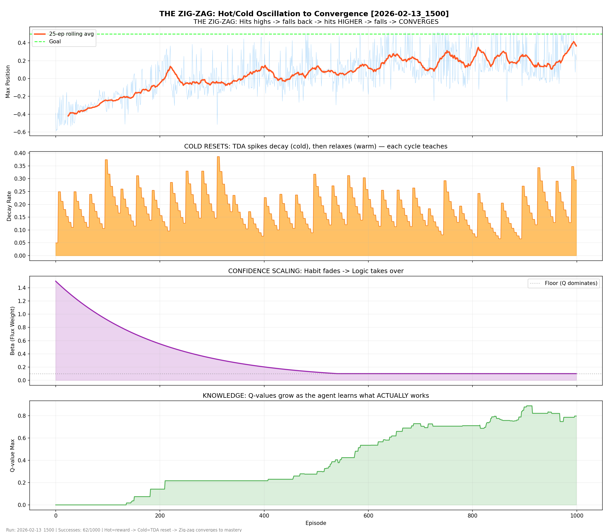

#### Phase Space: From Loop of Futility → Post-TDA Healing
| Before TDA | After TDA |
|:---:|:---:|
| 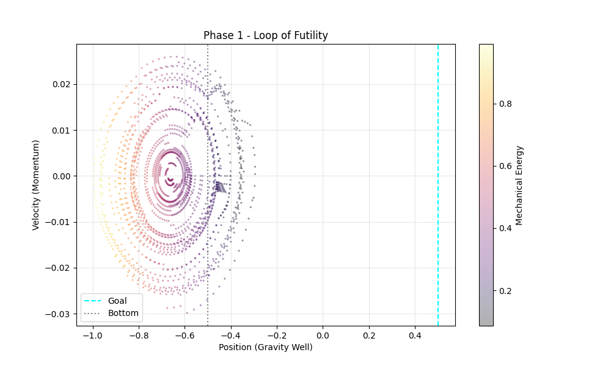 | 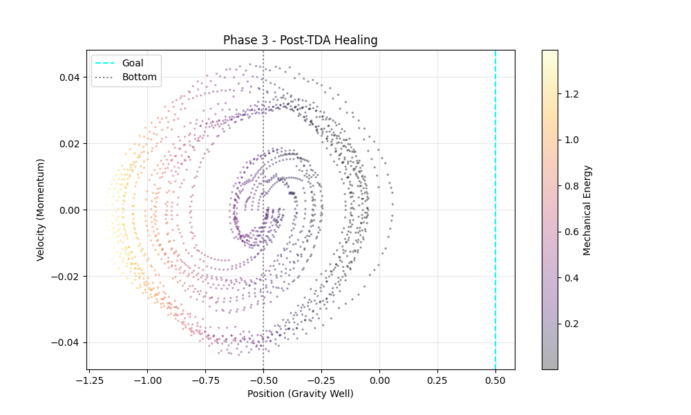 |

#### The Well Addiction Trap
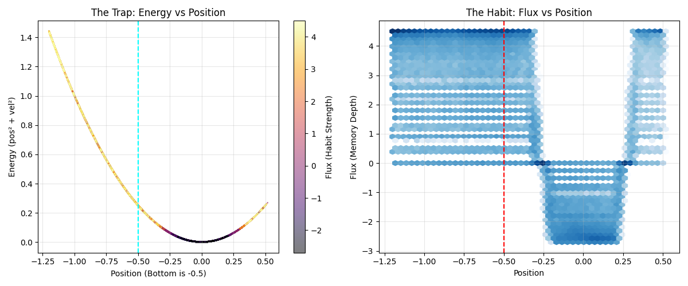

### Phase 2: Niodoo Dream (Feb 15) — 617 wins

Introduced the Niodoo physics engine and dream replay. Forces from an LLM-inspired vocabulary (Gravity Well, Repulsion, Viscosity, Adrenaline, Ghost Vector) are mapped to Mountain Car physics.

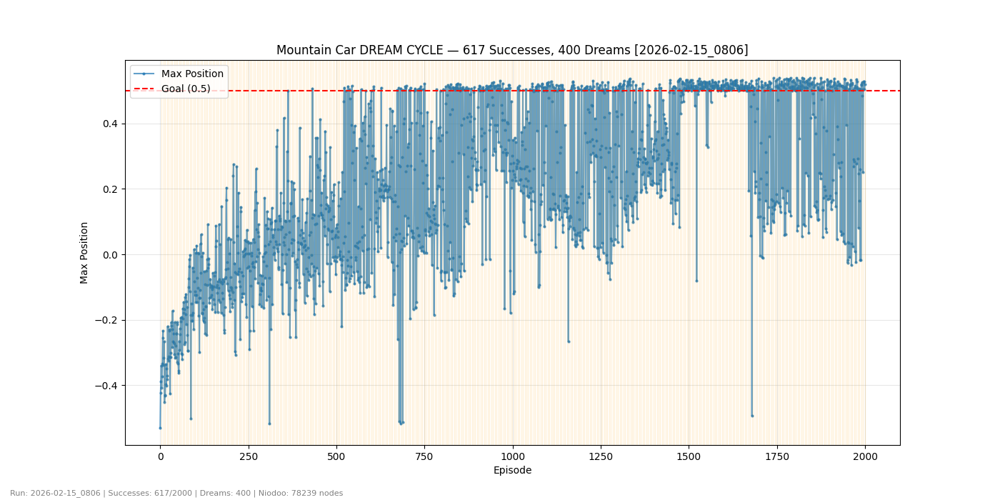

### Phase 3: Energy Pump (Feb 16) — 2000/2000 wins (100%)

The "push it in the direction it's going" heuristic. A trivially perfect solver (~119 steps/episode) that bypasses learning entirely. This is the well-known resonance strategy — it works, but it doesn't learn.

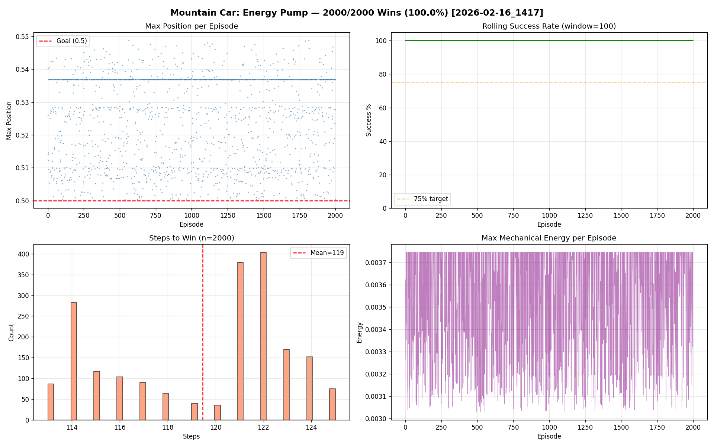

### Phase 4: The Bridge Experiments (Feb 17) — The Most Revealing Phase

**The question:** Can a perfect "body" (energy pump) teach a learning "mind" (Q-SMA)?

**Run 1 (Bridge 2000/2000):** Looks perfect — but the Governor override curve goes *up*, not down. The body does all the work. The mind never learns.

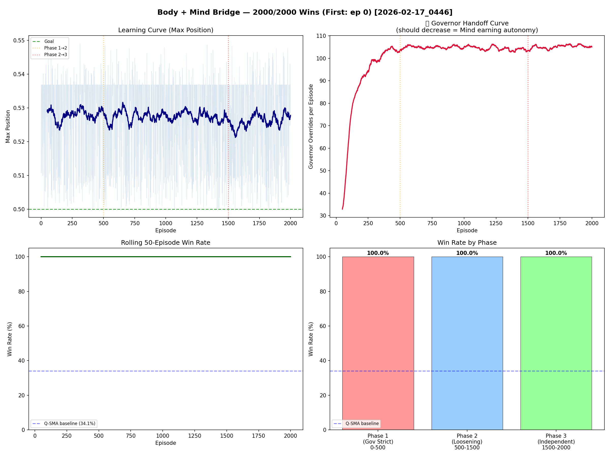

**Run 2 (Bridge 1522/2000):** The real test. Governor overrides drop to 0 at episode 1500. The mind immediately collapses to **4.4% win rate** — *worse* than the Q-SMA baseline of 34.1%.

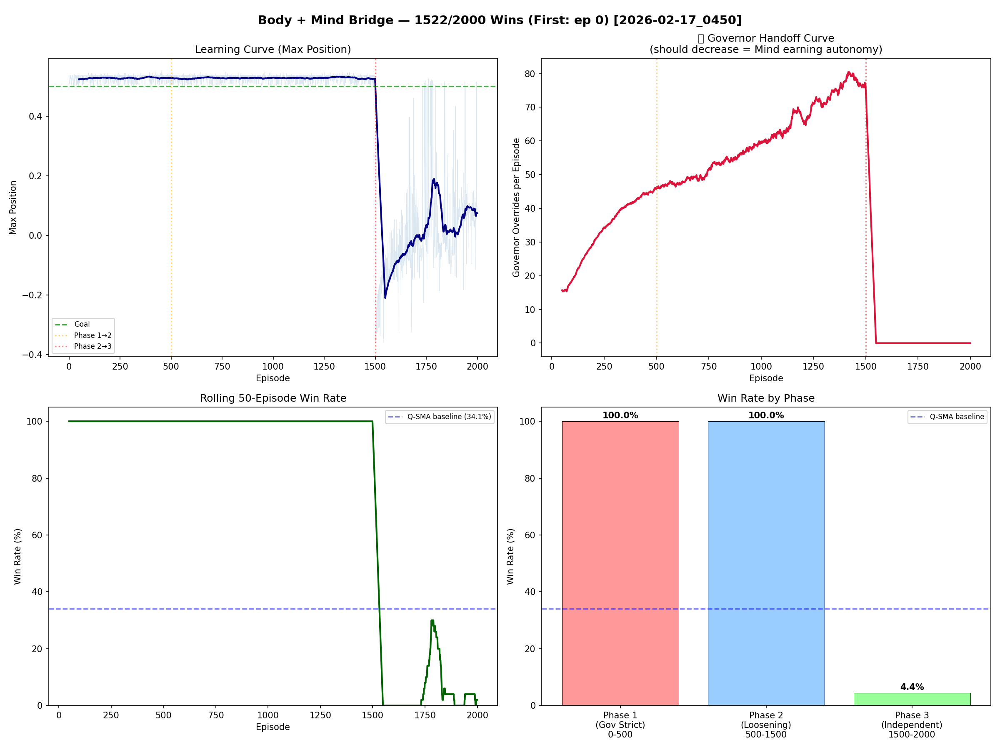

> **The most important finding:** Having a perfect teacher override your decisions doesn't teach you anything. The teacher actively *prevented* learning by shielding the agent from consequences.

**Splat Memory Pivot:** 12 iterations evolving from splat reflexes in action selection (0/2000 — reflex spam at 3000-5000/ep overwhelmed the agent) to splats influencing only dream replay (628/2000 — soft curriculum through sleep).

| Splat Reflexes ON (0/2000 wins) | Splat Dreams Only (599/2000 wins) |
|:---:|:---:|
| 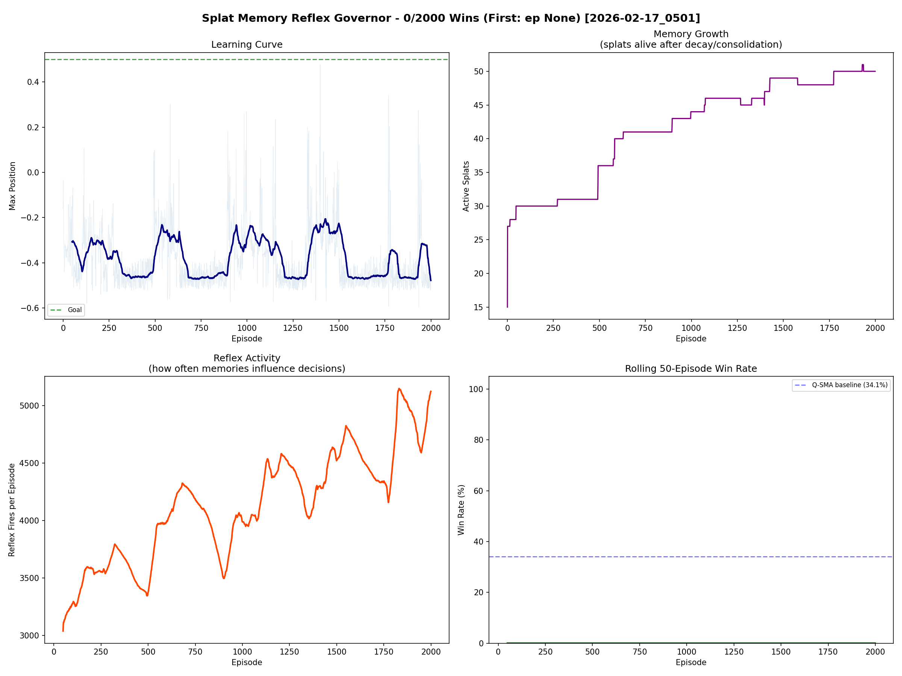 | 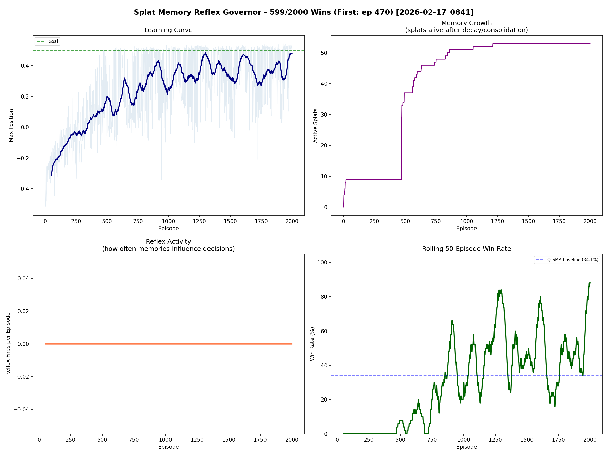 |

---

## Hypotheses

| Hypothesis | Status | Evidence |
|:-----------|:-------|:---------|
| Yin-Yang Reward (potential-based shaping) | ✅ Confirmed | 0 → 76 wins on this single change |
| System 1→2 Handoff (beta decay) | ✅ Confirmed | Breakthroughs cluster when beta hits floor |
| TDA Metacognitive Loop | ⚠️ Partial | Loop detection works; unclear if Ripser adds value over density heuristic |
| Viscosity/Flow Physics Model | ❌ Failed → adapted | "Correct" physics = 0 wins; naive binary = 76; log-scale = 681 |
| Splat Memory Reflexes | ⚠️ Uncertain | Disabled in act(); only influence dreams. Untested in final form |
| Niodoo Force Vocabulary | ⚠️ Partial | Works as standalone solver; unclear contribution in mixed system |
| Bridge (Body→Mind) | ❌ Failed as designed | Perfect teacher prevents learning; 4.4% when independent |

---

## Key Takeaways

1. **Signal strength > physical accuracy** — a binary "this is good/bad" outperforms smooth physics gradients
2. **The zig-zag IS the learning** — oscillation between exploration and exploitation converges from above
3. **Teachers who override prevent learning** — the agent must face consequences to learn from them
4. **Influence dreams, not decisions** — soft curriculum through sleep replay works; direct reflex overrides don't

---

## Phase 5: Controlled Ablation Study (Feb 27, 2026)

**Branch:** `experiments/ablation-and-scaling`  
**Code:** `src/experiments/` — five new scripts with live matplotlib dashboards

### What we tested

The previous phases were exploratory: add a component, observe results. Phase 5 is the first **controlled experiment** — systematically removing one component at a time to isolate what each one actually contributes. Every configuration ran with identical seeds, episode counts, and training conditions.

**Five configurations:**

| Config | TDA | Splat Memory | Bridge (Instinct + Governor) |
|--------|-----|-------------|------------------------------|
| `full` | ✅ | ✅ | ✅ |
| `no_tda` | ❌ | ✅ | ✅ |
| `no_splats` | ✅ | ❌ | ✅ |
| `no_bridge` | ✅ | ✅ | ❌ |
| `baseline` | ❌ | ❌ | ❌ |

---

### Experiment 1 — 2,000 Episodes × 3 Seeds

#### Results

| Config | Mean Win% | ±Std | First Win |
|--------|----------|------|-----------|
| **full** | **77.5%** | ±0.6% | ep 0 |
| **no_tda** | **77.3%** | ±0.7% | ep 0 |
| **no_splats** | **78.1%** | ±1.0% | ep 0 |
| `no_bridge` | 31.1% | ±0.7% | ep 433 |
| `baseline` | 25.1% | ±1.2% | ep 479 |

#### 2k Ablation — Comparison Chart
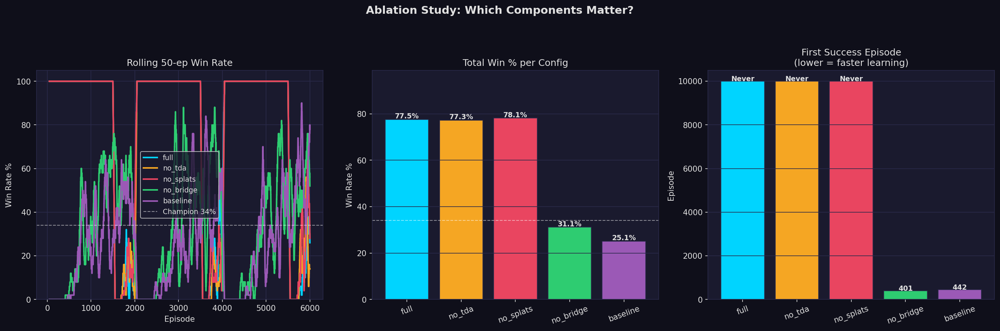

**Observation:** At 2,000 episodes, the Bridge (physics instinct seed + governor) accounts for the vast majority of the win rate difference. Removing TDA or Splats produces changes within noise (±1%). Removing the Bridge drops from 77.5% → 31.1%. Removing everything (baseline pure Q-learning with energy shaping) gives 25.1%.

---

### Experiment 2 — 20,000 Episodes × 2 Seeds

**Key design change:** Governor scaffold turns off at episode 3,000 (15% of total). The remaining 17,000 episodes are pure free learning — no physics override.

#### Results

| Config | Total Win% | **Post-Scaffold %** | First Win |
|--------|-----------|---------------------|-----------|
| `full` | 88.3% | 86.2% | ep 0 |
| `no_tda` | 84.5% | 81.7% | ep 0 |
| `no_splats` | 88.6% | **86.6%** | ep 0 |
| `no_bridge` | 87.9% | **96.1%** | ep 416 |
| `baseline` | 83.9% | **92.9%** | ep 536 |

#### 20k Long-Run — Comparison Chart
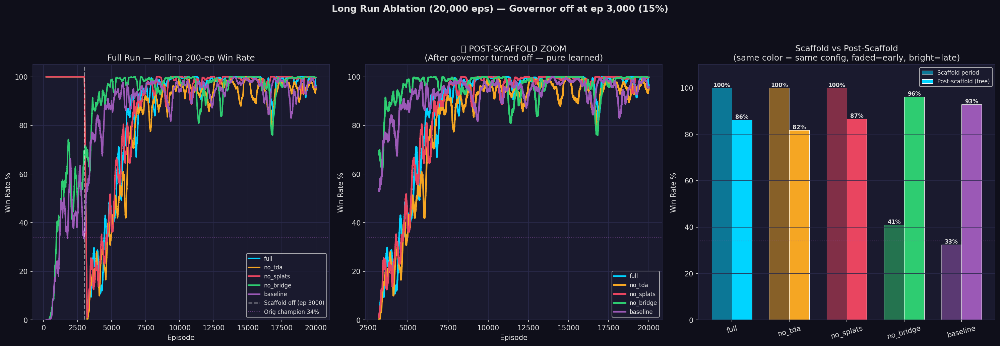

#### Full config — 20k live dashboard (seed 42)
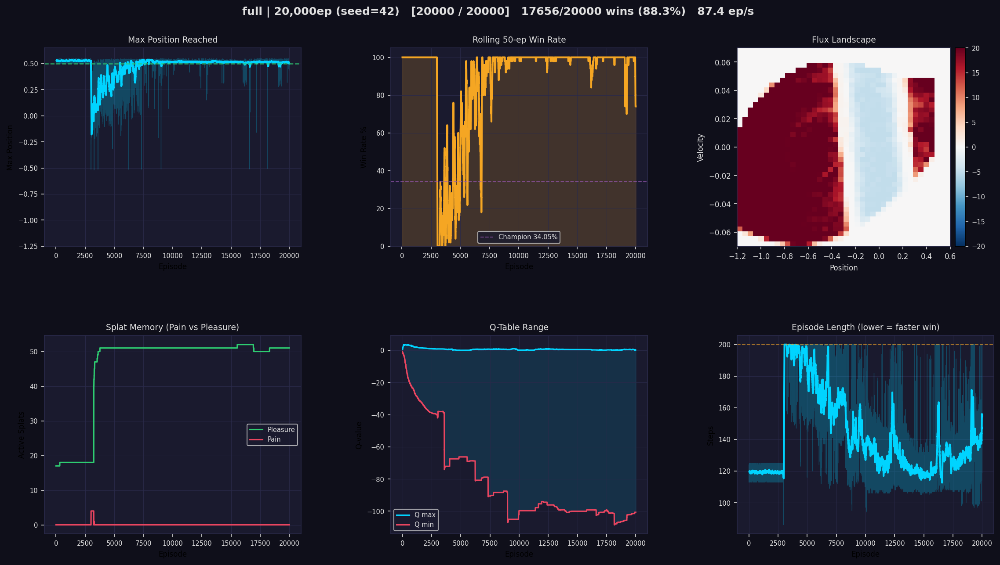

#### No-Bridge config — 20k live dashboard (seed 42)
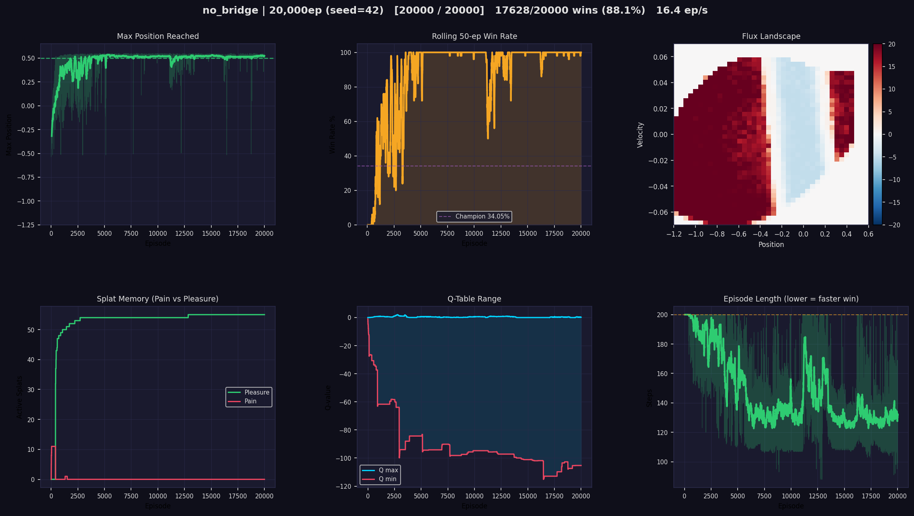

**Observation:** The post-scaffold win rate column reverses the 2k ranking. Agents that never had a governor (`no_bridge`: 96.1%, `baseline`: 92.9%) outperform scaffolded agents (`full`: 86.2%) in free learning. This suggests the bridge bootstrap creates a dependency that caps long-run learning ceiling. TDA contributes a measurable ~4.5% in post-scaffold performance (`no_tda`: 81.7% vs `full`: 86.2%). Splat Memory remains within noise at this episode count.

---

### Full PDF Report

A complete 17-page factual report with raw data tables, all learning curves, cross-experiment comparison, and 10 embedded plots is available:

📄 **`results/QSMa_Experiment_Report_2026-02-27.pdf`**

---

## Updated Hypotheses

| Hypothesis | Status | Evidence |
|:-----------|:-------|:---------|
| Yin-Yang Reward (potential-based shaping) | ✅ Confirmed | 0 → 76 wins on this single change; baseline at 25% (2k) and 83.9% (20k) confirms shaping does heavy lifting |
| System 1→2 Handoff (beta decay) | ✅ Confirmed | Breakthroughs cluster when beta hits floor |
| TDA Metacognitive Loop | ⚠️ Weak positive | +4.5pp post-scaffold lift at 20k. Noise at 2k. Ripser value vs heuristic still untested |
| Viscosity/Flow Physics Model | ❌ Failed → adapted | "Correct" physics = 0 wins; log-scale flux = 77.5% |
| Splat Memory | ❌ Not detectable | Within noise at both 2k and 20k. May require >20k or different metric |
| Niodoo Force Vocabulary | ⚠️ Partial | Works as standalone solver; unclear contribution in mixed system |
| Bridge (Body→Mind) | ⚠️ Time-horizon dependent | Dominant at 2k (77.5% vs 31.1%). Active liability at 20k (post-scaffold 86.2% vs no_bridge 96.1%) |

---

## Key Takeaways

1. **Signal strength > physical accuracy** — a binary "this is good/bad" outperforms smooth physics gradients
2. **The zig-zag IS the learning** — oscillation between exploration and exploitation converges from above
3. **Teachers who override prevent learning** — the agent must face consequences to learn from them (confirmed again at 20k)
4. **Influence dreams, not decisions** — soft curriculum through sleep replay works; direct reflex overrides don't
5. **Inductive bias is a double-edged sword** — physics instinct gives a fast start but caps the long-run ceiling
6. **Give the agent time** — at 2k, everything looks like the Bridge. At 20k, the Q-learner catches up

---

## Running the Experiment Suite

`bash reproduce.sh` covers the main ablation. To run the other experiments individually:

```bash
# Create venv and install pinned dependencies (reproduce.sh does this too)
python3 -m venv .venv
.venv/bin/pip install -r requirements.txt

cd src

# 2k ablation (5 configs × 3 seeds, ~45 min)
MPLBACKEND=Agg    ../.venv/bin/python3 -m experiments.ablation_study

# 20k long-run ablation (5 configs × 2 seeds, ~2.5 hrs)
MPLBACKEND=Agg    ../.venv/bin/python3 -m experiments.long_run_ablation

# Shorter smoke tests
MPLBACKEND=Agg    ../.venv/bin/python3 -m experiments.ablation_study --episodes 200 --seeds 1
MPLBACKEND=Agg    ../.venv/bin/python3 -m experiments.long_run_ablation --episodes 5000 --seeds 1

# Other experiments (flux scaling, episode scaling, dream ratio, TDA value)
MPLBACKEND=Agg    ../.venv/bin/python3 -m experiments.flux_scaling_comparison
MPLBACKEND=Agg    ../.venv/bin/python3 -m experiments.episode_scaling
MPLBACKEND=Agg    ../.venv/bin/python3 -m experiments.dream_ratio_sweep
MPLBACKEND=Agg    ../.venv/bin/python3 -m experiments.tda_value_test
```

Results (JSON + PNG) save automatically to `results/`. The examples above use `MPLBACKEND=Agg`, which runs headlessly on any OS and still writes every plot to `results/`. For a **live dashboard window** during training, set a GUI backend for your platform instead: `MacOSX` on macOS, or `TkAgg`/`Qt5Agg` on Linux/Windows (the experiment runner also auto-detects one and falls back to `Agg` if none work).

---

## Snapshots

Each snapshot in `snapshots/` contains a `TECHNICAL_WRITEUP.md` with full architectural details, math, and analysis for that point in time. Key snapshots:

- **`2026-02-13_1456_76wins/`** — First successful configuration. Contains the original zig-zag discovery.
- **`FINAL_CHAMPION_681wins_LOG_FLUX/`** — Pre-ablation highest performer (34.05% win rate).

#### Pre-Ablation Champion: 681/2000 Wins (34.05%)
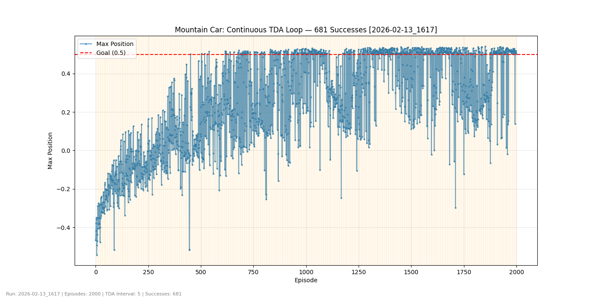

---

## Dependencies

Pinned in `requirements.txt` (verified on Python 3.11): `gymnasium`, `numpy`, `matplotlib`, `ripser` (persistent homology — optional at runtime, falls back to a density heuristic), `persim`, `scikit-learn`, `networkx`.

```bash
python3 -m venv .venv && .venv/bin/pip install -r requirements.txt
```

---

## About

Research codebase exploring how RL agents might learn through habit, memory, dreams, and self-correction — not only pure reward maximization.

### Why this exists

Niodoo steering (December lineage) is a collaboration between Jason Van Pham (Ruffian-L) and AI co-engineers Grok (xAI), Claude (Anthropic), and Gemini (Google). This repository applies the same ideas — physics forces, habit fields, topological self-monitoring — to MountainCar-v0 for controlled, re-runnable experiments. Formal credit: [AUTHORSHIP.md](AUTHORSHIP.md).

### Notes

- A physics-forces-only scripted solver is not treated as a learning result; Phase 3 documents that distinction.
- Bridge ablations study what happens when a teacher overrides agent decisions too strongly.
- The 2k ablation pipeline runs end-to-end with pinned dependencies (`bash reproduce.sh --quick`, verified 2026-07-21). Full-scale tables above are from the February 2026 runs.
- Historical results before 2026-07-21 used partial seeding; re-runs should match closely, not bit-for-bit.
- Phases 1–4 live under `snapshots/` and `research_history/` as the historical record.

---

## License

[MIT](LICENSE)
